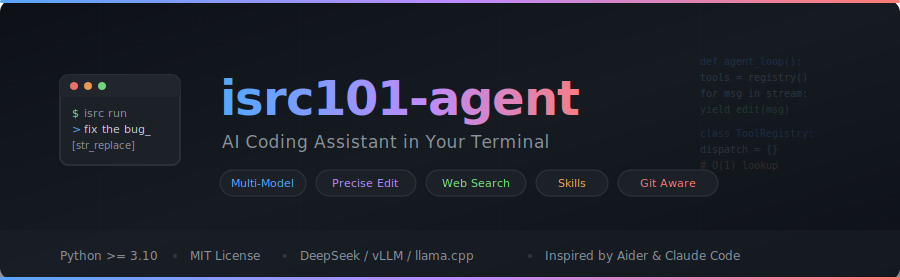

<p align="center">
  
</p>

<p align="center">
  <strong>AI 编程助手，运行在你的终端中</strong><br/>
  受 Aider 和 Claude Code 启发，专为代码项目优化<br/>
  <strong>🚀 v1.1：全屏 TUI + 多智能体协作 + 结构化搜索</strong>
</p>

<p align="center">
  <a href="#快速开始">快速开始</a> &nbsp;·&nbsp;
  <a href="#核心特性">特性</a> &nbsp;·&nbsp;
  <a href="#命令速查">命令</a> &nbsp;·&nbsp;
  <a href="#tui-全屏模式">TUI</a> &nbsp;·&nbsp;
  <a href="#配置">配置</a> &nbsp;·&nbsp;
  <a href="#架构">架构</a>
</p>

---

## v1.1 更新摘要

**全屏 TUI 模式**
- Textual 全屏界面：RichLog 消息区 + 底部极简输入（仅顶部分隔线，无完整边框）
- `● Read src/main.py` 实时工具活动指示器（ActivityBar）
- `/` 键触发命令面板自动补全（CommandPalette），上下键导航、Tab/Enter 选中
- 交互式模型/技能/会话选择器（SelectionInput），上下键 + Enter，替代 prompt\_toolkit

**新命令**
- `/copy` — 复制对话内容到剪贴板或导出文件

**搜索质量提升**
- 3 阶段链式搜索：发现 → 钻取 → 深度抓取，后续轮次利用前序结果中提取的关键词

**兼容性修复**
- TUI 下 `/compact`、`/model`、`/skills`、`/sessions` 不再崩溃

---

## 快速开始

### 安装
```bash
git clone https://github.com/ISRC101Lab/isrc101-agent.git
cd isrc101-agent
bash setup.sh               # 一键安装（虚拟环境 + 依赖 + 配置）
source .venv/bin/activate
```

### 运行
```bash
cd /path/to/your/project

# 终端模式（经典 prompt_toolkit UI）
isrc run

# 全屏 TUI 模式（推荐）
isrc run --tui

# 单次查询
isrc ask "帮我分析这个 Python 代码"
```

### 直接运行（无需安装）
```bash
python main.py run          # 终端模式
python main.py run --tui    # TUI 模式
```

## 核心特性

| 特性 | 说明 |
|------|------|
| **全屏 TUI** | Textual 全屏界面，实时活动指示、命令面板自动补全、交互式选择器 |
| **多模型切换** | DeepSeek V3/R1、Qwen3-VL、本地模型 (vLLM/llama.cpp)，`/model` 交互选择 |
| **精准编辑** | `str_replace` 精确替换 + Git 自动提交 |
| **双模式** | `agent` 模式（读写 + 命令执行）/ `ask` 模式（只读分析） |
| **多智能体协作** | `/crew` 启动 coder / reviewer / researcher / tester 四角色协作 |
| **链式搜索** | 3 阶段结构化搜索：关键词提取 → 精确钻取 → 深度抓取 |
| **联网搜索** | Jina Reader + Bing 搜索，`/web on` 开启 |
| **技能系统** | `skills/*/SKILL.md` 可插拔工作流 |
| **并行工具调用** | 自动并行执行独立只读工具调用 |
| **纯文本输出** | 流式渲染零延迟，无 markdown 符号干扰 |
| **剪贴板集成** | `/copy` 复制对话到剪贴板或导出到文件 |

## 命令速查

| 命令 | 功能 | 命令 | 功能 |
|------|------|------|------|
| `/model` | 选择模型（交互式） | `/mode agent\|ask` | 切换模式 |
| `/skills` | 管理技能（交互式） | `/web on\|off` | 联网开关 |
| `/crew <task>` | 多智能体协作 | `/grounding` | 证据约束模式 |
| `/copy` | 复制对话到剪贴板 | `/copy file <path>` | 导出对话到文件 |
| `/compact` | 压缩上下文 | `/context` | 上下文用量 |
| `/config` | 管理配置 | `/display` | 显示策略 |
| `/sessions` | 会话管理（交互式） | `/stats` | 会话统计 |
| `/git` | Git 状态 | `/diff` | 查看变更 |
| `/undo` | 撤销文件操作 | `/theme` | 切换主题 |
| `/reset` | 清空对话 | `/quit` | 退出 |

### `/copy` 用法
```bash
/copy              # 复制最后一条 assistant 回复
/copy all          # 复制全部对话
/copy 5            # 复制最后 5 条消息
/copy file out.md  # 导出到文件（SSH/无剪贴板环境）
```

### `/crew` 多智能体协作
```bash
/crew 重构用户认证模块，添加测试并审查代码质量
/crew 实现支付功能，包括 API 接口、数据库迁移和单元测试
```

## TUI 全屏模式

```bash
isrc run --tui
```

**布局**（从上到下）：

```
┌─ Header ─────────────────────────────────────────┐
│                                                   │
│  RichLog — 可滚动消息区                            │
│                                                   │
├─ ● Read  src/main.py ────────── ActivityBar ──────┤
├─ model:gpt-4  mode:agent  ctx:42% ── StatusBar ──┤
──────────────────────────────────── separator ──────
  输入区（/ 触发命令面板）                    ChatInput
```

- **ActivityBar**：工具执行时显示 `● Read`、`● Bash`、`● Edit` 等实时状态，空闲自动隐藏
- **CommandPalette**：输入 `/` 自动弹出命令列表，上下键导航，Tab 填充，Enter 提交
- **SelectionInput**：`/model`、`/skills`、`/sessions` 弹出交互选择器，上下键 + Enter/Esc
- **极简输入框**：仅顶部分隔线，无完整边框

**快捷键**：

| 按键 | 功能 |
|------|------|
| `Enter` | 发送 / 确认选择 |
| `Ctrl+C` | 中断当前操作 |
| `Ctrl+D` | 退出（双击确认） |
| `Esc` | 聚焦输入框 |
| `↑` `↓` | 历史记录 / 命令面板导航 / 选择器导航 |
| `Tab` | 命令面板：填充选中命令 |

## 配置

配置文件优先级：`./.agent.conf.yml`（项目级）> `~/.isrc101-agent/config.yml`（全局）

```yaml
# 核心配置
reasoning-display: summary          # off | summary | full
web-display: brief                  # brief | summary | full
answer-style: concise               # concise | balanced | detailed
tool-parallelism: 4                 # 1-12, 并行工具调用数
api-key-env: DEEPSEEK_API_KEY       # 从环境变量读取密钥（推荐）
use-unicode: true                   # Unicode 图标（false = ASCII 回退）

# 联网 & 证据
grounded-web-mode: strict           # off | strict
grounded-retry: 1                   # 0-3, 校验失败自动重试
grounded-visible-citations: sources_only
grounded-context-chars: 8000        # 800-40000

# Crew 多智能体
crew:
  max-parallel: 2                   # 每角色最大并行实例数
  token-budget: 200000              # 全 crew 共享 token 预算
  auto-review: true                 # 自动 code review 循环
  max-rework: 2                     # 最大返工次数
```

> **安全提醒**：不要将 API 密钥提交到版本控制，使用 `api-key-env` 从环境变量读取。

## 架构

```
isrc101_agent/
├── main.py              CLI 入口 (click)
├── agent.py             对话循环 + tool call 调度 + ProgressContext
├── llm.py               LLM 适配层 (litellm) + system prompt
├── config.py            配置加载（YAML + 环境变量）
├── command_router.py    / 命令路由 + /copy 命令
├── grounding.py         链式搜索（3 阶段：发现→钻取→深度抓取）
├── skills.py            技能发现与 prompt 注入
├── stream_renderer.py   纯文本流式渲染（零延迟直写 stdout）
├── rendering.py         工具结果 / diff / 面板渲染
├── ui.py                终端 UI（prompt_toolkit + rich）
├── tui/
│   ├── app.py           ISRCApp — Textual 全屏应用
│   ├── app.tcss         样式表（极简分隔线风格）
│   ├── widgets.py       ChatInput / CommandPalette / ActivityBar /
│   │                    SelectionInput / StatusBar / ConfirmInput
│   └── console_adapter.py  TUIConsole — Rich Console 兼容适配层
├── crew/
│   ├── coordinator.py   任务分解 + 事件循环 + 结果综合
│   ├── worker.py        AgentWorker 线程
│   ├── roles.py         角色定义（coder / reviewer / researcher / tester）
│   ├── board.py         TaskBoard 线程安全状态机
│   ├── messages.py      MessageBus 跨智能体通信
│   ├── context.py       SharedTokenBudget 全局预算
│   └── rendering.py     Crew 专用进度渲染
└── tools/
    ├── registry.py      工具注册表（O(1) 分发）
    ├── file_ops.py      文件操作（read / write / str_replace）
    ├── git_ops.py       Git 操作（auto-commit）
    └── web_ops.py       联网（Jina Reader + Bing 搜索）
```

**设计要点**

- **O(1) 工具调度** — dict 查找替代 match/case
- **模式隔离** — ask 模式自动过滤写入与命令执行工具
- **纯文本直出** — 流式直写 stdout，无 markdown 解析开销
- **TUI 双轨渲染** — 终端模式用 Rich Status spinner，TUI 模式用 ActivityBar 非阻塞更新
- **链式搜索** — `_extract_leads()` 从结果中提取关键词 → `_build_chain_query()` 演化查询 → 累积 URL 队列深度抓取
- **多智能体** — Coordinator 分解 → Worker 并行 → MessageBus 通信 → code review 循环

## 技术栈

```
Python >= 3.10
litellm · rich · click · prompt_toolkit · pyyaml · requests · tiktoken
python-dotenv · textual · pyperclip
```

## Roadmap

- [x] **全屏 TUI** — Textual 全屏界面 + ActivityBar + CommandPalette
- [x] **多智能体协作** — `/crew` 四角色协作系统
- [x] **链式搜索** — 3 阶段结构化搜索替代扁平轮转
- [x] **剪贴板集成** — `/copy` 命令
- [ ] MCP 协议 — 接入 Model Context Protocol
- [ ] RAG 集成 — 项目级向量索引
- [ ] 上下文压缩 — 长对话自动摘要
- [ ] 多模型混合 — reasoner 规划 + chat 执行

## 许可证

[MIT License](LICENSE)
